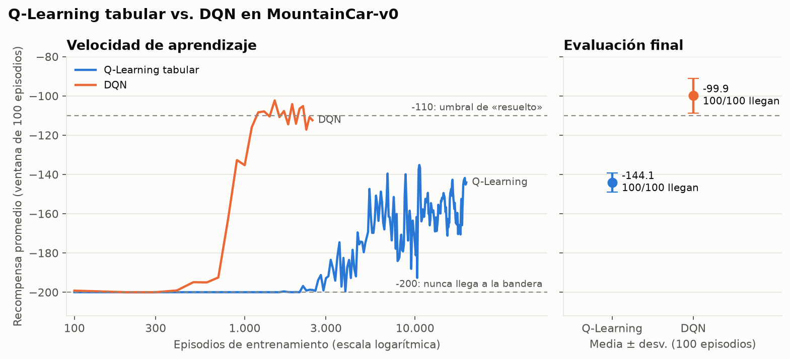
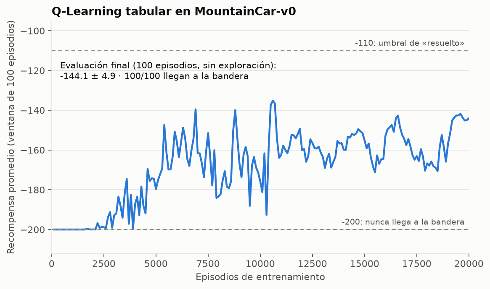
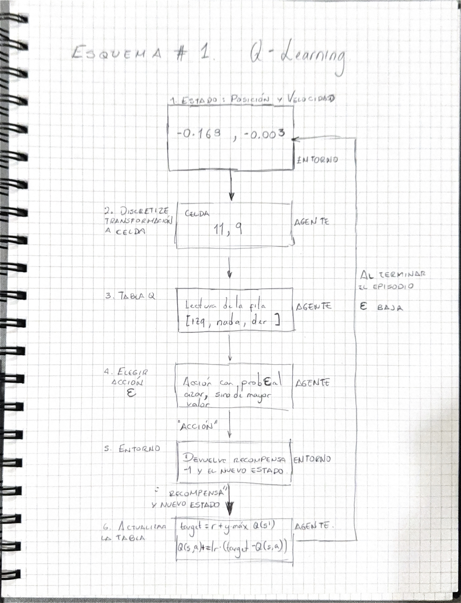
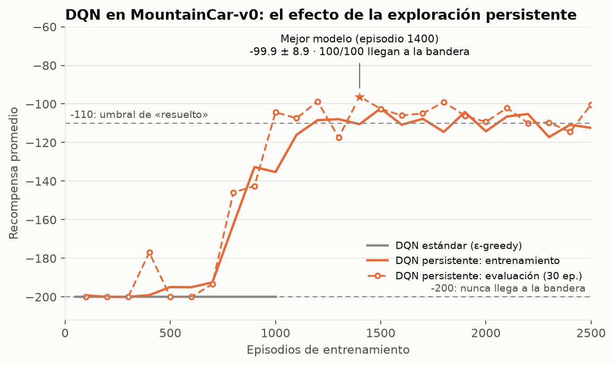
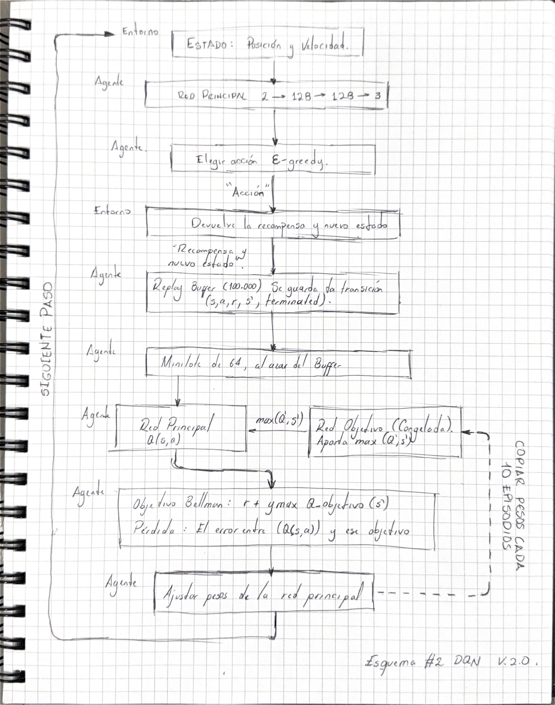

# MountainCar-v0: Q-Learning tabular vs. Deep Q-Network

Implementación y comparación de dos agentes de Aprendizaje por Refuerzo que resuelven
[MountainCar-v0](https://gymnasium.farama.org/environments/classic_control/mountain_car/):

- un agente de **Q-Learning tabular**, que discretiza el espacio de estados, y
- un agente **DQN** (Deep Q-Network), que aproxima la función de valor-acción con una red neuronal.

El repositorio parte del repositorio base del curso
([emiliomunozai/mountain_car](https://github.com/emiliomunozai/mountain_car)), donde la CLI, los bucles de
entrenamiento y el guardado ya venían escritos y los algoritmos eran ejercicios marcados como `EXERCISE`.
Aquí se completaron esos ejercicios, se diagnosticó por qué el DQN estándar no aprende en este entorno y se
comparó el desempeño de ambos métodos.

## Resumen de resultados

Evaluación final de cada agente: 100 episodios sin exploración (política codiciosa). Detalle en
[`results/evaluacion_final.json`](results/evaluacion_final.json).

| Agente | Episodios de entrenamiento | Recompensa media | Episodios que llegan a la bandera |
|---|---:|---:|---:|
| Q-Learning tabular | 20.000 | -144.1 ± 4.9 | 100/100 |
| DQN (mejor modelo) | 1.400 | -99.9 ± 8.9 | 100/100 |

La recompensa es -1 por paso, con un máximo de 200 pasos: -200 significa que el carro nunca llegó a la bandera, y
se considera "resuelto" un promedio de -110 o mejor.




Una vez finalizado el entrenamiento, evaluamos ambos agentes en 100 episodios sin exploración. Los dos lograron alcanzar la meta en todos los episodios, aunque presentaron diferencias en su desempeño.

Q-Learning obtuvo una recompensa media de -144,1, mientras que DQN alcanzó -99,9. Dado que el entorno asigna una recompensa de -1 por paso, estos resultados indican que DQN necesitó, en promedio, menos pasos para llegar a la bandera.

Durante el entrenamiento, DQN mostró una mejora considerable a partir de aproximadamente 700 episodios, mientras que Q-Learning presentó una evolución más gradual. El umbral de -110 incluido en la gráfica permite visualizar la evolución de la recompensa promedio, pero no determina por sí solo si el agente alcanza la meta.

Q-Learning se entrenó durante 20.000 episodios y DQN durante 1.400. Sin embargo, esta diferencia no implica necesariamente un menor costo computacional para DQN, debido a las diferencias entre ambos métodos.

En conclusión, ambos agentes lograron resolver el problema, aunque DQN alcanzó la meta utilizando menos pasos en promedio durante la evaluación. Para obtener conclusiones más generales, sería necesario repetir los experimentos con diferentes semillas aleatorias y comparar la estabilidad de los resultados.

## 1. El entorno

Un carro poco potente está en un valle y debe llegar a la bandera (posición `0.5`). Su motor no alcanza para subir
directamente, así que tiene que mecerse de un lado a otro para tomar impulso.

| Estado (2 valores continuos) | Rango |
|---|---|
| Posición | -1.2 a 0.6 |
| Velocidad | -0.07 a 0.07 |

| Acción (3 discretas) | Significado |
|:---:|---|
| 0 | Acelerar a la izquierda |
| 1 | No acelerar |
| 2 | Acelerar a la derecha |

La recompensa es **-1 en cada paso**, sin ninguna otra señal. Mientras el agente no llegue a la bandera por
casualidad, todos los estados valen lo mismo y no hay gradiente que seguir. Esta característica es la que hace
interesante el problema y explica el diagnóstico de la sección 5.

## 2. Instalación y uso

Requiere [uv](https://docs.astral.sh/uv/) (instala Python 3.11 y las dependencias automáticamente).

```bash
uv sync
uv run mountaincar inspect --steps 3     # ver el entorno
uv run mountaincar train qlearning --episodes 20000
uv run mountaincar load qlearning --eval
uv run mountaincar render qlearning      # ver al agente en una ventana
```

Comandos disponibles: `version`, `list`, `inspect`, `init`, `train`, `load`, `sim`, `render`, `delete`.
`<agent>` puede ser `qlearning` o `dqn`.

## 3. Estructura del repositorio

```
src/mountain_car/
├── cli.py               # interfaz de línea de comandos (viene del repo base)
└── agents/
    ├── qlearning.py     # Q-Learning tabular (ejercicios 1a, 1b, 1c)
    └── dqn.py           # DQN (ejercicios 2a, 2b y 3)
scripts/                 # evaluación, entrenamiento con puntos de control, experimentos y gráficas
results/                 # logs de entrenamiento/evaluación y gráficas de evidencia
random_check.py          # cuenta cuántos episodios llega a la bandera un agente aleatorio
EXERCISES.md             # enunciado de los ejercicios (repo base)
```

## 4. Q-Learning tabular

### Qué hace

El estado continuo (posición, velocidad) se corta en una cuadrícula de 20 × 20 celdas. La tabla Q guarda un valor
por cada par (celda, acción) y se corrige después de cada paso hacia el objetivo de Bellman:

```
target   = recompensa + gamma * max_a' Q(s', a')      (solo recompensa si el episodio terminó)
Q(s, a) += lr * (target - Q(s, a))
```

### Qué se implementó (`src/mountain_car/agents/qlearning.py`)

- `discretize`: convierte (posición, velocidad) en la tupla `(bin_posición, bin_velocidad)` con `np.digitize`.
- `select_action`: política ε-greedy; con `deterministic=True` nunca explora.
- `_update`: la actualización de Q-Learning, sin sumar el término del futuro cuando el episodio terminó
  (`terminated`).

### Hiperparámetros

`n_bins = 20`, `lr = 0.1`, `gamma = 0.99`, ε de 1.0 a 0.01 con decaimiento 0.9995 por episodio.
Se entrenaron 20.000 episodios; se visitaron 299 de las 400 celdas posibles.

### Resultados



El promedio se queda en -200 durante los primeros ~2.500 episodios (el carro no llega a la bandera), luego mejora y
oscila aproximadamente entre -135 y -190 hasta terminar cerca de -144. La evaluación final da **-144.1 ± 4.9 y
100/100 llegadas a la bandera**. Logs: [`results/qlearning_train.log`](results/qlearning_train.log) y
[`results/qlearning_eval.log`](results/qlearning_eval.log).

### Esquema del entrenamiento



Ciclo de un paso de entrenamiento (dibujo propio, con un ejemplo numérico de un paso real del agente entrenado).

## 5. Deep Q-Network (DQN)

### Qué hace

La tabla se reemplaza por una red neuronal que recibe el estado continuo (sin discretizar) y devuelve un valor Q por
acción. Se apoya en dos mecanismos: un **buffer de repetición** (se aprende de mini-lotes al azar de transiciones
pasadas) y una **red objetivo** (una copia congelada de la red, usada para calcular el objetivo de Bellman y que se
sincroniza cada 10 episodios).

### Qué se implementó (`src/mountain_car/agents/dqn.py`)

- `QNetwork`: perceptrón `2 → 128 → 128 → 3` con ReLU entre capas y sin activación en la salida (17.283 parámetros).
- `_learn`: valor `Q(s, a)` de la red principal, objetivo `r + gamma * max Q_objetivo(s')` sin gradiente y anulado
  cuando `terminated`, pérdida MSE y un paso de Adam.
- Exploración persistente en `select_action` (ver el diagnóstico más abajo).

### Hiperparámetros

`lr = 1e-3` (Adam), `gamma = 0.99`, `batch_size = 64`, buffer de 100.000 transiciones, sincronización de la red
objetivo cada 10 episodios, ε de 1.0 a 0.01 con decaimiento 0.995 por episodio y `repeat_prob = 0.9`.

### Diagnóstico: por qué el DQN estándar no aprende

Con `_learn` y `QNetwork` correctos, el DQN con ε-greedy estándar da una recompensa **plana en -200**: en 1.000
episodios cada uno de los 20 puntos del log marca exactamente -200.00
([`results/dqn_baseline_1000.log`](results/dqn_baseline_1000.log)). Se investigó en tres pasos:

1. **¿Falla el código de aprendizaje?** Se probó el mismo agente en CartPole, un entorno que sí resuelve: el
   promedio sube de 23.6 (episodio 25) a 288.5 (episodio 100)
   ([`results/dqn_cartpole_check.log`](results/dqn_cartpole_check.log)). El aprendizaje funciona; el problema es
   específico de MountainCar.
2. **¿Qué ve el agente?** Un agente que actúa completamente al azar llega a la bandera en **0 de 300 episodios**
   ([`random_check.py`](random_check.py)). Nunca observa el evento que debería aprender a provocar, así que solo ve
   transiciones de recompensa -1 y la red no tiene qué distinguir.
3. **¿Por qué?** Para subir, el carro necesita empujes sostenidos hacia el mismo lado (como un columpio). La
   ε-greedy estándar elige una acción nueva e independiente en cada paso de exploración, así que los empujes se
   cancelan; repetir la misma acción 20 veces seguidas con tres opciones tiene probabilidad (1/3)^20 ≈ 3 entre
   10.000 millones. Entrenar más episodios no ayuda.

### Solución: exploración con persistencia

Cuando toca explorar, con probabilidad `repeat_prob` el agente **repite su última acción exploratoria** y con
probabilidad `1 - repeat_prob` elige una nueva al azar. La última acción se olvida al inicio de cada episodio y la
evaluación sigue siendo 100% codiciosa. No se modificó la recompensa, el entorno ni la regla de aprendizaje.

Antes de elegir `repeat_prob` se midió cuántos de 300 episodios llegan a la bandera con exploración puramente
aleatoria y persistencia `p` ([`scripts/persistence_check.py`](scripts/persistence_check.py),
[`results/persistence_check.log`](results/persistence_check.log)):

| p (probabilidad de repetir) | Episodios que llegan a la bandera (de 300) |
|---:|---:|
| 0.0 (ε-greedy estándar) | 0 |
| 0.5 | 0 |
| 0.8 | 3 |
| 0.9 | 13 |
| 0.95 | 30 |

Se usó `p = 0.9`. No se probaron valores mayores ni se comparó su efecto en el entrenamiento completo.

Se consideró y descartó modificar la recompensa (*reward shaping*): el ejercicio pide cambiar solo la exploración, y
alterar la recompensa de un solo agente haría injusta la comparación con Q-Learning.

### Resultados



Con exploración persistente, el promedio de entrenamiento sale de -200 hacia el episodio ~700 y se estabiliza entre
-102 y -118 desde el ~1.100. Cada 100 episodios se evaluó la política congelada con 30 episodios
([`scripts/train_dqn_checkpoints.py`](scripts/train_dqn_checkpoints.py),
[`results/dqn_progress.log`](results/dqn_progress.log)): desde el episodio 1.000 llegó a la bandera en 30 de 30
episodios en todas las evaluaciones salvo una (29/30 en el 1.600). El mejor punto de control fue el del episodio
1.400 y, reevaluado con 100 episodios nuevos, da **-99.9 ± 8.9 y 100/100 llegadas a la bandera**
([`results/evaluacion_final.json`](results/evaluacion_final.json)).

**Advertencia sobre la selección del modelo.** En una primera corrida de 2.500 episodios el último modelo guardado
rindió mucho peor en evaluación (-178.3 ± 43.4 y 2/10 llegadas,
[`results/dqn_eval.log`](results/dqn_eval.log)) que el promedio del entrenamiento (~-107,
[`results/dqn_train.log`](results/dqn_train.log)). No se llegó a establecer la causa. Por eso se guarda el mejor
punto de control según evaluación congelada en lugar del último modelo, una práctica habitual en DQN por la
oscilación de la política entre actualizaciones.

### Esquema del entrenamiento



Ciclo de un paso de entrenamiento del DQN (dibujo propio): replay buffer, red principal, red objetivo y actualización de Bellman.

## 6. Comparación de los dos métodos

| Aspecto | Q-Learning tabular | DQN |
|---|---|---|
| Representación del valor | Tabla de 20 × 20 celdas × 3 acciones | Red `2 → 128 → 128 → 3` (17.283 parámetros) sobre el estado continuo |
| Empieza a mejorar | ~2.500 episodios | ~700 episodios |
| Estabilidad durante el entrenamiento | Oscila entre ~-135 y -190 | Entre ~-102 y -118 desde el episodio ~1.100 |
| Evaluación final (100 episodios) | -144.1 ± 4.9, 100/100 | -99.9 ± 8.9, 100/100 |
| Alcanza el umbral de -110 | No | Sí |
| Episodios usados | 20.000 | 1.400 (mejor punto de control de una corrida de 2.500) |
| Exploración | ε-greedy estándar fue suficiente | Necesitó exploración con persistencia |
| Dificultad de implementación | Tres funciones cortas, pocos hiperparámetros | Más piezas (red, buffer, red objetivo) y un fallo silencioso que requirió diagnóstico |
| Sensibilidad | Estable entre evaluaciones | La política oscila entre actualizaciones; conviene guardar el mejor punto de control |

**Análisis.** El DQN aprende bastante más rápido en episodios y termina con mejor recompensa. Una explicación
plausible es que la discretización obliga al Q-Learning a aprender cada celda por separado y pierde información
dentro de cada celda, mientras que la red trabaja sobre el estado continuo y generaliza entre estados vecinos. A
cambio, el DQN es más frágil: sin el arreglo de exploración no aprendió nada, y el modelo final de una corrida
puede ser peor que uno intermedio.

**Hipótesis no verificada.** Q-Learning aprendió con la ε-greedy estándar y el DQN no. Una posible razón es que la
tabla parte de ceros mientras todas las recompensas son negativas, lo que actúa como *inicialización optimista*:
cada acción aún no probada en una celda parece mejor que las ya probadas, y el agente tiende a probarlas de forma
sistemática. La red no tiene ese efecto. No se hizo ningún experimento para comprobarlo.

## 7. Limitaciones

- Cada método se entrenó **una sola vez** (una semilla); no se midió la variabilidad entre corridas.
- El mejor punto de control del DQN se eligió con 30 episodios de evaluación y se reevaluó con 100 episodios nuevos.
- No se ajustaron hiperparámetros. El Q-Learning queda en -144, por debajo de los ~-133 que indica el repositorio base
  para una implementación correcta.
- No se midió el tiempo de cómputo de cada método, así que la comparación es solo en episodios.

## 8. Reproducir los resultados

```bash
uv sync
uv run python random_check.py                                         # agente aleatorio: 0/300
uv run python scripts/persistence_check.py                            # efecto de la persistencia
uv run mountaincar train qlearning --episodes 20000
uv run python -u scripts/train_dqn_checkpoints.py | tee results/dqn_progress.log
cp saves/dqn_best.pt saves/dqn_mountaincar.pt                         # dejar el mejor modelo como agente dqn
uv run python scripts/evaluate_agents.py                              # evaluación final (100 episodios)
uv run python scripts/make_plots.py                                   # gráficas de results/
```
## 9. Conclusiones
El desarrollo de este proyecto nos permitió implementar y comparar dos métodos de aprendizaje por refuerzo para resolver el problema MountainCar-v0.

El principal desafío del entorno consiste en que el vehículo no tiene suficiente potencia para alcanzar directamente la meta. Por esta razón, el agente debe aprender una secuencia de acciones que le permita acumular impulso y llegar a la bandera.

Durante el desarrollo del proyecto encontramos que la estrategia de exploración tiene un papel importante en el aprendizaje. En particular, el agente DQN presentó dificultades para encontrar una política que le permitiera alcanzar la meta mediante la exploración convencional. Para abordar esta situación, se incorporó una estrategia que favorece la repetición de acciones durante la exploración.

Los resultados finales muestran que ambos agentes lograron resolver el problema en los episodios de evaluación. Q-Learning alcanzó una recompensa media de -144,1 y DQN obtuvo una recompensa media de -99,9.

A partir de estos resultados, identificamos que DQN logró alcanzar la meta utilizando menos pasos en promedio, mientras que Q-Learning también consiguió completar la tarea mediante una representación discretizada de los estados.

Como oportunidad de mejora, consideramos importante realizar nuevos experimentos con diferentes semillas aleatorias y configuraciones de hiperparámetros. Esto permitiría evaluar la estabilidad de los resultados y comprender mejor cómo influyen las decisiones de entrenamiento en el comportamiento de cada agente.

Finalmente, el proyecto nos permitió comprender de forma práctica cómo dos métodos de aprendizaje por refuerzo pueden abordar un mismo problema mediante representaciones y mecanismos de aprendizaje diferentes.


## Referencias

- Sutton, R. S. y Barto, A. G. (2018). *Reinforcement Learning: An Introduction* (2.ª ed., caps. 4-6). MIT Press.
- Documentación de Gymnasium: [MountainCar-v0](https://gymnasium.farama.org/environments/classic_control/mountain_car/).
- Lapan, M. (2020). *Deep Reinforcement Learning Hands-On* (2.ª ed.). Packt.
